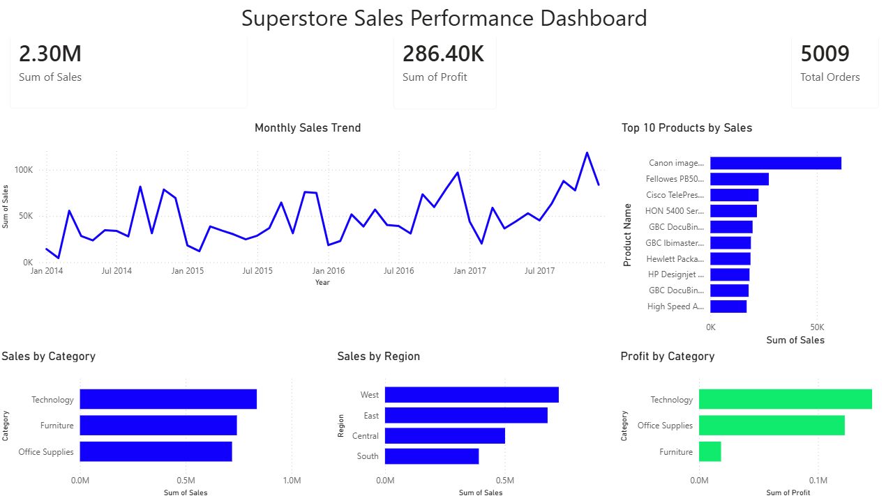

# Retail Sales Analytics Dashboard

## Project Overview

This project analyzes retail sales data from the Superstore dataset to identify sales trends, profitability drivers, regional performance, and top-performing products.

The project demonstrates an end-to-end data analyst workflow:

**Data Source → SQL Analysis → Power BI Dashboard → Business Insights**

The goal was to transform raw sales data into actionable insights through data analysis and interactive visualization.

---

## Business Questions

This project answers key business questions:

* How are sales and profit performing overall?
* How do sales change over time?
* Which product categories generate the most revenue?
* Which regions contribute the most sales?
* Which categories are the most profitable?
* Which products drive the highest revenue?

---

## Dataset

**Dataset:** Superstore Sales Dataset (Kaggle)

The dataset contains retail transaction data including:

* Orders
* Customers
* Products
* Categories
* Sales
* Discounts
* Profit
* Geographic information

---

## Tools Used

| Tool         | Purpose                                   |
| ------------ | ----------------------------------------- |
| SQL (SQLite) | Data exploration and business analysis    |
| Power BI     | Interactive dashboard development         |
| Excel        | Data source                               |
| GitHub       | Project documentation and version control |

---

# SQL Analysis

SQL was used to analyze the dataset and answer business questions before building the Power BI dashboard.

Analysis included:

* Total sales and profit calculations
* Category performance analysis
* Regional sales analysis
* Product ranking
* Order-level analysis

Example analyses:

* Total revenue and profitability
* Sales by category
* Sales by region
* Top-performing products

SQL queries are available in:

```
SQL/superstore_analysis.sql
```

---

# Power BI Dashboard

The interactive dashboard provides an executive overview of retail performance.

## Dashboard Features

### Key Performance Indicators

* Total Sales
* Total Profit
* Total Orders

### Sales Analysis

* Monthly Sales Trend
* Sales by Category
* Sales by Region

### Profitability Analysis

* Profit by Category

### Product Analysis

* Top 10 Products by Sales

---

## Dashboard Preview



---

# Key Insights

* Technology generated the highest profit among product categories.
* West region showed the strongest sales performance.
* The Canon imageCLASS 2200 Advanced Copier was the top revenue-generating product.
* Sales performance showed seasonal trends over time.
* Revenue and profitability varied significantly across categories.

---

# Project Structure

```
Retail Sales Analytics Dashboard
│
├── Data
│   └── Superstore.xlsx
│
├── SQL
│   └── superstore_analysis.sql
│
├── Power BI
│   └── Superstore_Sales_Dashboard.pbix
│
├── Images
│   └── dashboard.png
│
├── superstore.db
│
└── README.md
```

---

# Skills Demonstrated

* SQL querying and data analysis
* Data cleaning and preparation
* Business intelligence reporting
* Power BI dashboard development
* Data visualization
* KPI development
* Business insight generation

---

## Author

Tsion Eshetu

Data Analyst Portfolio Project
